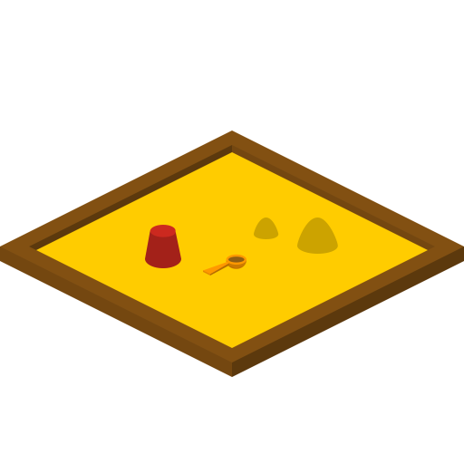

<html>
    <p align="center">
        
    </p>
    <h1 align="center">Sandbox</h1>
    <p align="center">
       Dynamic gametype controller for Halo Custom Edition
    </p>
</html>


# Sandbox
Sandbox is custom dynamic gametype controller for SAPP, instead of using the builtin "events"
system from SAPP, this  project provides different actions called "toys" and precreated events ready
to be used on specific gametypes files per map, using a simple YAML:
```yml
name: rocketmania
description: Everyone spawns with rockets!
version: 1
like: slayer
when:
  player:
    spawns:
      - erase weapons
      - add weapon -> weapons\rocket launcher
      - add weapon -> weapons\rocket launcher
```

## How it works
Sandbox loads different definitions from a .yml file that has a structure capable of bind events
from the file into the game dynamically.

It provides a way to deal with the organization of different map files and tons of other
gametypes that are designed for specific maps:
```
gametypes/
    forge_island/
        - assasin.yml
    bloodgulch/
        - fatrat.yml
    bigass/
        - zombies.yml
``` 

## Why should I use it?
In contrast with the events system every gametype executed here is dynamic and can be replaced at any time on the game, you can load any other gametype dynamically if needed by just using this 
command:
```
lg assasin
```

# Contribute to Sandbox
All the sandbox project is on the works and every help is welcome! Do not forget to join us on the [Shadowmods Discord Server](https://discord.shadowmods.net) if you want to discuss and talk about this or other projects for Halo Custom Edition.
